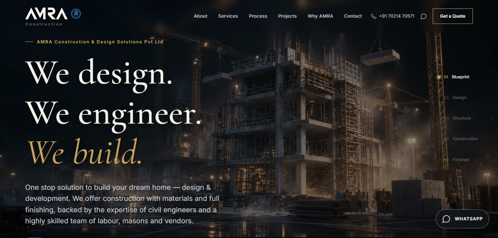

# AMRA Construction & Design Solutions

Premium construction and architectural services website for **AMRA Construction & Design Solutions Pvt Ltd**, Purnea, Bihar.



## Live Website

https://amra-construction.hacker09.workers.dev

> Custom domain: `amraconstruction.com` — coming soon.

## About

AMRA Construction & Design Solutions provides construction and design solutions across Purnea, Forbesganj and Katihar.

The website was designed with a premium architectural aesthetic combining cinematic construction visuals, blueprint-inspired elements, responsive layouts and modern UI interactions.

## Features

- Responsive desktop and mobile design
- Cinematic construction background
- Architectural/blueprint visual theme
- Services and service-detail pages
- Projects showcase
- Project-detail pages
- Construction packages
- Built-up-area cost calculator
- WhatsApp integration
- Direct phone contact
- Contact and location information
- Responsive navigation
- Scroll progress indicator
- Process indicator
- Error boundary
- Security headers
- SPA routing
- Cloudflare Workers deployment

## Tech Stack

- React
- Vite
- JavaScript
- CSS
- React Router
- Lucide React
- Cloudflare Workers
- Cloudflare Static Assets

## Project Structure

```text
src/
├── assets/
├── components/
├── data/
└── pages/

public/
└── _headers
